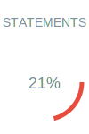
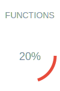

# TrancheMaster

**Calculator for *Impôt sur le Revenu* (IR), the French income tax.**

TrancheMaster helps you determine your tax bracket based on your income, or estimate the income required to reach a specific tax threshold. It uses the **official 2025 tax brackets** as published on [service-public.fr](https://www.service-public.fr/particuliers/actualites/A18045). For advanced simulations, you can also use [the official simulator](https://simulateur-ir-ifi.impots.gouv.fr/calcul_impot/2025/).

## Description 🤔

<details open>
  <summary>🇬🇧 English</summary>
  Welcome!
  **TrancheMaster** is a calculator for the French income tax (*Impôt sur le Revenu*). It allows you to:
  - Determine your tax bracket based on your income.
  - Estimate the income corresponding to a specific tax threshold.
  The simulator uses the **official 2025 tax brackets** to provide accurate, up-to-date results. Whether you're planning your finances or just curious, TrancheMaster simplifies understanding your tax obligations.
</details>

<details>
  <summary>🇫🇷 Français</summary>
  Bienvenue !
  **TrancheMaster** est une calculette pour l'*Impôt sur le Revenu* (IR) en France. Elle vous permet de :
  - Déterminer votre tranche d'imposition en fonction de vos revenus.
  - Estimer le revenu correspondant à un seuil d'impôt donné.
  Le simulateur utilise les **tranches officielles 2025** pour des résultats précis et actualisés. Que vous planifiez vos finances ou soyez simplement curieux, TrancheMaster rend vos obligations fiscales claires et accessibles.
</details>

<details>
  <summary>🇪🇸 Español</summary>
  ¡Bienvenido!
  **TrancheMaster** es una calculadora para el impuesto sobre la renta francés (*Impôt sur le Revenu*). Permite:
  - Determinar su tramo impositivo según sus ingresos.
  - Estimar los ingresos correspondientes a un umbral fiscal específico.
  El simulador utiliza las **escalas oficiales de 2025** para ofrecer resultados precisos y actualizados. Ya sea para planificar sus finanzas o por curiosidad, TrancheMaster simplifica la comprensión de sus obligaciones fiscales.
</details>

<details>
  <summary>🇩🇪 Deutsch</summary>
  Willkommen!
  **TrancheMaster** ist ein Rechner für die französische Einkommensteuer (*Impôt sur le Revenu*). Damit können Sie:
  - Ihre Steuerklasse basierend auf Ihrem Einkommen bestimmen.
  - Das Einkommen schätzen, das einem bestimmten Steuersatz entspricht.
  Der Simulator nutzt die **offiziellen Steuersätze 2025** für genaue und aktuelle Ergebnisse. Egal, ob Sie Ihre Finanzen planen oder einfach neugierig sind, TrancheMaster macht Ihre Steuerverpflichtungen verständlich.
</details>

## App Link 🚀

Try the app directly: **[TrancheMaster on GitHub Pages](https://odysseu.github.io/TrancheMaster/)**


## Deploy and Try Locally 💻

This is a **static website** using local files and JavaScript packages from [jsDelivr CDN](https://cdn.jsdelivr.net).

### Prerequisites

- **git**: Ensure you have git (version 2 or higher) installed. Download it from [git-scm.com](https://git-scm.com/downloads
- **python**: Ensure you have python (version 3.5 or higher) installed. Download it from [python.org](https://www.python.org/downloads/).

### Deploy

If you wish to deploy the app localy and visualise it in your browser :

- Clone the Repository:

  ```sh
  git clone https://github.com/odysseu/TrancheMaster.git
  ```

- Go to the project root :

  ```
  cd TrancheMaster
  ```

- Launch the app :

  ```sh
  python -m http.server
  ```

- Open in your favorite browser `http://localhost:8000/`


### Hint if developing in codespace

If you're using codespace, for exemple the URL could be `https://fictional-something-...-end.github.dev`, then you can add in the URL `-8000.app` and will be able to see the app at `https://fictional-something-...-end-8000.app.github.dev`

## Testing 🧪

**Test Coverage :**

     

Special thanks to [js-coverage-badges](https://github.com/marialuisacp/js-coverage-badges) !

### Prerequisites

- **Node.js**: Ensure you have Node.js (version 16 or higher) installed. Download it from [nodejs.org](https://nodejs.org).
- **npm**: npm is included with Node.js. Ensure it's up-to-date.

### Setup

- Clone the Repository:

  ```sh
  git clone https://github.com/odysseu/TrancheMaster.git
  ```

- Go to the project root :

  ```sh
  cd HabitatCalc
  ```

- Install Dependencies:

  ```sh
  npm install
  ```

### Running Tests

To run the tests, use the following command:

  ```sh
  npm test
  ```

### Writing Tests

- **Framework**: We use [Jest](https://jestjs.io) for testing.
- **Test Files**: Place your test files in the `tests/` directory. Use the `.test.js` or `.spec.js` extensions.
- **Assertions**: Use Jest's built-in matchers for assertions.

#### Test files exemples

See the `*.test.js` files in the `tests/` directory for test file inspiration